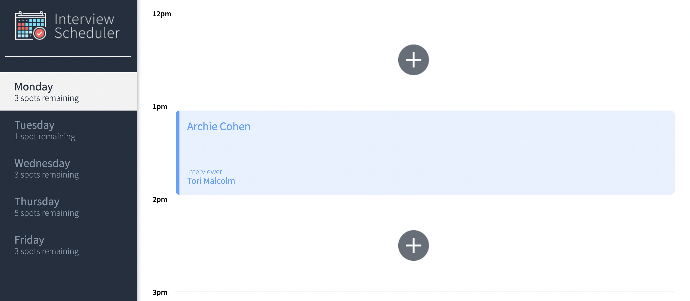
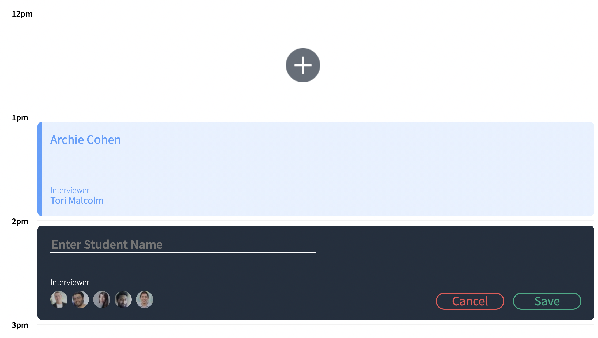
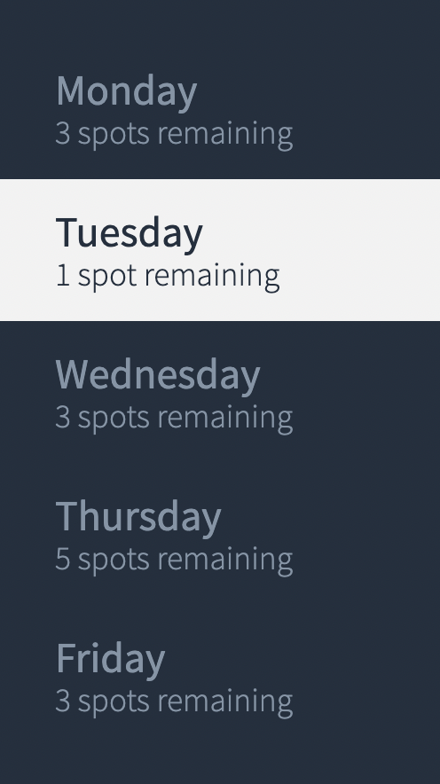

# Interview Scheduler

## Description

Interview Scheduler is an interactive React application in which a user can book or cancel interviews. The application keeps track of which timeslots have been already booked so there are no conflicts.

## Setup

Install dependencies with `npm install`.

## Required Project Dependencies

- axios
- @testing-library/react-hooks
- react-test-renderer

## Running Webpack Development Server

```sh
npm start
```

## Running Jest Test Framework

```sh
npm test
```

## Running Storybook Visual Testbed

```sh
npm run storybook
```

## Quick Look into the application

### Main page



### Create Appointment Form



### List of days with available spots


